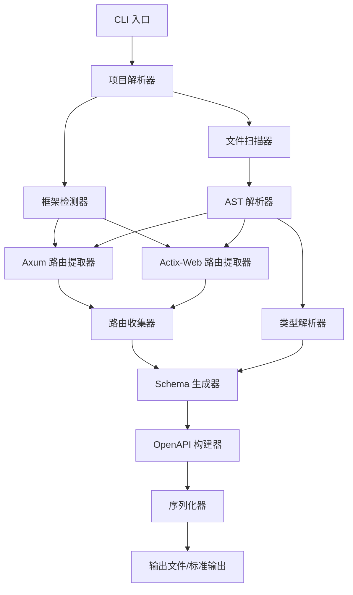
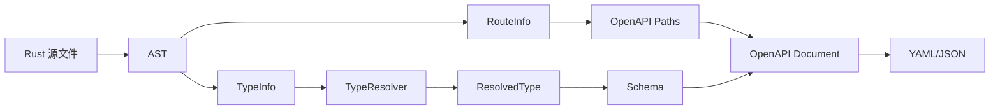

# 设计文档

## 概述

本工具是一个命令行应用程序，用于从 Rust Web 项目自动生成 OpenAPI 3.0 文档。工具采用静态代码分析方法，通过解析 Rust 源代码的抽象语法树（AST）来提取路由信息和数据结构定义。

核心设计理念：
- **模块化架构**：将代码解析、路由提取、schema 生成和文档输出分离为独立模块
- **框架抽象**：通过统一的接口支持多个 Web 框架，便于扩展
- **渐进式解析**：优雅处理无法解析的代码，不因局部错误而中断整体流程
- **零运行时依赖**：纯静态分析，无需编译或运行目标项目

## 架构

### 系统架构图



### 数据流

1. **输入阶段**：CLI 接收用户参数（项目路径、输出格式等）
2. **扫描阶段**：递归遍历项目目录，收集所有 .rs 文件
3. **解析阶段**：使用 syn crate 将源代码解析为 AST
4. **提取阶段**：根据框架类型，从 AST 中提取路由定义
5. **类型解析阶段**：分析处理函数的参数和返回类型，解析相关结构体
6. **生成阶段**：构建 OpenAPI 文档结构，生成 schema 定义
7. **输出阶段**：序列化为 YAML 或 JSON 格式并输出

## 组件和接口

### 1. CLI 模块 (`cli.rs`)

**职责**：处理命令行参数，协调整体流程

**主要结构**：
```rust
pub struct CliArgs {
    pub project_path: PathBuf,
    pub output_format: OutputFormat,
    pub output_path: Option<PathBuf>,
    pub framework: Option<Framework>,
    pub verbose: bool,
}

pub enum OutputFormat {
    Yaml,
    Json,
}

pub enum Framework {
    Axum,
    ActixWeb,
}
```

**接口**：
- `parse_args() -> Result<CliArgs>` - 解析命令行参数
- `run(args: CliArgs) -> Result<()>` - 执行主流程

### 2. 文件扫描器 (`scanner.rs`)

**职责**：递归遍历项目目录，收集 Rust 源文件

**主要结构**：
```rust
pub struct FileScanner {
    root_path: PathBuf,
}

pub struct ScanResult {
    pub rust_files: Vec<PathBuf>,
    pub warnings: Vec<String>,
}
```

**接口**：
- `new(root_path: PathBuf) -> Self`
- `scan() -> Result<ScanResult>` - 扫描目录并返回所有 .rs 文件路径

### 3. AST 解析器 (`parser.rs`)

**职责**：将 Rust 源代码解析为抽象语法树

**依赖**：使用 `syn` crate 进行语法解析

**主要结构**：
```rust
pub struct AstParser;

pub struct ParsedFile {
    pub path: PathBuf,
    pub syntax_tree: syn::File,
}
```

**接口**：
- `parse_file(path: &Path) -> Result<ParsedFile>` - 解析单个文件
- `parse_files(paths: &[PathBuf]) -> Vec<Result<ParsedFile>>` - 批量解析文件

### 4. 框架检测器 (`detector.rs`)

**职责**：检测项目使用的 Web 框架

**主要结构**：
```rust
pub struct FrameworkDetector;

pub struct DetectionResult {
    pub frameworks: Vec<Framework>,
}
```

**接口**：
- `detect(parsed_files: &[ParsedFile]) -> DetectionResult` - 通过分析 use 语句和依赖来检测框架

### 5. 路由提取器接口 (`extractor/mod.rs`)

**职责**：定义统一的路由提取接口

**主要结构**：
```rust
pub trait RouteExtractor {
    fn extract_routes(&self, parsed_file: &ParsedFile) -> Vec<RouteInfo>;
}

pub struct RouteInfo {
    pub path: String,
    pub method: HttpMethod,
    pub handler_name: String,
    pub parameters: Vec<Parameter>,
    pub request_body: Option<TypeInfo>,
    pub response_type: Option<TypeInfo>,
}

pub enum HttpMethod {
    Get, Post, Put, Delete, Patch, Options, Head,
}

pub struct Parameter {
    pub name: String,
    pub location: ParameterLocation,
    pub type_info: TypeInfo,
    pub required: bool,
}

pub enum ParameterLocation {
    Path,
    Query,
    Header,
}

pub struct TypeInfo {
    pub name: String,
    pub is_generic: bool,
    pub generic_args: Vec<TypeInfo>,
    pub is_option: bool,
    pub is_vec: bool,
}
```

### 6. Axum 路由提取器 (`extractor/axum.rs`)

**职责**：从 Axum 项目中提取路由信息

**实现策略**：
- 查找 `Router::new()` 调用和方法链
- 识别 `.route()`, `.get()`, `.post()` 等方法
- 处理 `.nest()` 进行路径组合
- 分析处理函数签名，识别 `Json<T>`, `Path<T>`, `Query<T>` 等提取器

**主要结构**：
```rust
pub struct AxumExtractor;

impl RouteExtractor for AxumExtractor {
    fn extract_routes(&self, parsed_file: &ParsedFile) -> Vec<RouteInfo>;
}
```

**内部方法**：
- `find_router_definitions(file: &syn::File) -> Vec<RouterDef>`
- `parse_route_method(method_call: &syn::ExprMethodCall) -> Option<RouteInfo>`
- `extract_handler_info(handler: &syn::Expr) -> HandlerInfo`
- `parse_extractors(fn_sig: &syn::Signature) -> Vec<Parameter>`

### 7. Actix-Web 路由提取器 (`extractor/actix.rs`)

**职责**：从 Actix-Web 项目中提取路由信息

**实现策略**：
- 查找路由宏（`#[get]`, `#[post]` 等）
- 解析宏参数获取路径
- 识别 `.service()` 和 `.scope()` 配置
- 分析处理函数签名，识别 `web::Json<T>`, `web::Path<T>` 等提取器

**主要结构**：
```rust
pub struct ActixExtractor;

impl RouteExtractor for ActixExtractor {
    fn extract_routes(&self, parsed_file: &ParsedFile) -> Vec<RouteInfo>;
}
```

**内部方法**：
- `find_route_macros(file: &syn::File) -> Vec<MacroRoute>`
- `parse_route_macro(attr: &syn::Attribute) -> Option<(HttpMethod, String)>`
- `find_service_config(file: &syn::File) -> Vec<ServiceConfig>`
- `parse_extractors(fn_sig: &syn::Signature) -> Vec<Parameter>`

### 8. 类型解析器 (`type_resolver.rs`)

**职责**：解析 Rust 类型定义，构建类型信息树

**主要结构**：
```rust
pub struct TypeResolver {
    parsed_files: Vec<ParsedFile>,
    type_cache: HashMap<String, ResolvedType>,
}

pub struct ResolvedType {
    pub name: String,
    pub kind: TypeKind,
}

pub enum TypeKind {
    Struct(StructDef),
    Enum(EnumDef),
    Primitive(PrimitiveType),
    Generic(String),
}

pub struct StructDef {
    pub fields: Vec<FieldDef>,
}

pub struct FieldDef {
    pub name: String,
    pub type_info: TypeInfo,
    pub optional: bool,
    pub serde_attrs: SerdeAttributes,
}

pub struct SerdeAttributes {
    pub rename: Option<String>,
    pub skip: bool,
    pub flatten: bool,
}
```

**接口**：
- `new(parsed_files: Vec<ParsedFile>) -> Self`
- `resolve_type(&mut self, type_name: &str) -> Option<ResolvedType>` - 解析类型定义
- `find_struct_definition(&self, name: &str) -> Option<&syn::ItemStruct>` - 查找结构体定义
- `parse_serde_attributes(attrs: &[syn::Attribute]) -> SerdeAttributes` - 解析 Serde 属性

### 9. Schema 生成器 (`schema_generator.rs`)

**职责**：将 Rust 类型转换为 OpenAPI Schema 定义

**主要结构**：
```rust
pub struct SchemaGenerator {
    type_resolver: TypeResolver,
    schemas: HashMap<String, Schema>,
}

pub struct Schema {
    pub schema_type: String,
    pub properties: Option<HashMap<String, Property>>,
    pub required: Vec<String>,
    pub items: Option<Box<Schema>>,
    pub enum_values: Option<Vec<String>>,
}
```

**接口**：
- `new(type_resolver: TypeResolver) -> Self`
- `generate_schema(&mut self, type_info: &TypeInfo) -> Schema` - 生成 schema
- `generate_parameter_schema(&mut self, param: &Parameter) -> ParameterSchema` - 生成参数 schema

**类型映射规则**：
- `String` → `type: string`
- `i32`, `i64`, `u32`, `u64` → `type: integer`
- `f32`, `f64` → `type: number`
- `bool` → `type: boolean`
- `Vec<T>` → `type: array, items: <T的schema>`
- `Option<T>` → 字段标记为非必需
- 自定义结构体 → `$ref: #/components/schemas/{TypeName}`

### 10. OpenAPI 构建器 (`openapi_builder.rs`)

**职责**：构建完整的 OpenAPI 文档结构

**主要结构**：
```rust
pub struct OpenApiBuilder {
    info: Info,
    paths: HashMap<String, PathItem>,
    components: Components,
}

pub struct Info {
    pub title: String,
    pub version: String,
    pub description: Option<String>,
}

pub struct PathItem {
    pub operations: HashMap<HttpMethod, Operation>,
}

pub struct Operation {
    pub summary: Option<String>,
    pub parameters: Vec<ParameterSchema>,
    pub request_body: Option<RequestBody>,
    pub responses: HashMap<String, Response>,
}

pub struct Components {
    pub schemas: HashMap<String, Schema>,
}
```

**接口**：
- `new() -> Self`
- `add_route(&mut self, route: &RouteInfo, schema_gen: &mut SchemaGenerator)` - 添加路由
- `build(self) -> OpenApiDocument` - 构建最终文档

### 11. 序列化器 (`serializer.rs`)

**职责**：将 OpenAPI 文档序列化为 YAML 或 JSON

**依赖**：使用 `serde_yaml` 和 `serde_json` crates

**接口**：
- `serialize_yaml(doc: &OpenApiDocument) -> Result<String>`
- `serialize_json(doc: &OpenApiDocument) -> Result<String>`
- `write_to_file(content: &str, path: &Path) -> Result<()>`

## 数据模型

### 核心数据流



### OpenAPI 文档结构

```rust
pub struct OpenApiDocument {
    pub openapi: String,  // "3.0.0"
    pub info: Info,
    pub paths: HashMap<String, PathItem>,
    pub components: Option<Components>,
}
```

## 错误处理

### 错误类型

```rust
pub enum Error {
    IoError(std::io::Error),
    ParseError { file: PathBuf, message: String },
    InvalidArgument(String),
    FrameworkNotDetected,
    SerializationError(String),
}

impl std::fmt::Display for Error {
    fn fmt(&self, f: &mut std::fmt::Formatter) -> std::fmt::Result {
        match self {
            Error::IoError(e) => write!(f, "IO 错误: {}", e),
            Error::ParseError { file, message } => {
                write!(f, "解析错误 {}: {}", file.display(), message)
            }
            Error::InvalidArgument(msg) => write!(f, "无效参数: {}", msg),
            Error::FrameworkNotDetected => write!(f, "未检测到支持的 Web 框架"),
            Error::SerializationError(msg) => write!(f, "序列化错误: {}", msg),
        }
    }
}
```

### 错误处理策略

1. **文件级错误**：单个文件解析失败时记录警告，继续处理其他文件
2. **类型解析失败**：无法解析的类型使用占位符 schema（`type: object`）
3. **框架检测失败**：如果未指定框架且无法自动检测，返回错误并提示用户手动指定
4. **输出错误**：文件写入失败时返回明确的错误信息

### 日志级别

- **ERROR**：致命错误，导致程序无法继续
- **WARN**：非致命问题，如无法解析某个文件或类型
- **INFO**：进度信息，如"已处理 50/100 个文件"
- **DEBUG**：详细调试信息（仅在 `--verbose` 模式下）

## 测试策略

### 单元测试

每个模块都应包含单元测试，覆盖核心功能：

1. **AST 解析器测试**：
   - 测试各种 Rust 语法结构的解析
   - 测试错误处理

2. **路由提取器测试**：
   - 为 Axum 和 Actix-Web 分别创建测试用例
   - 测试各种路由定义模式（简单路由、嵌套路由、参数路由）
   - 测试提取器识别

3. **类型解析器测试**：
   - 测试基本类型映射
   - 测试结构体解析
   - 测试 Serde 属性处理
   - 测试递归类型解析

4. **Schema 生成器测试**：
   - 测试各种 Rust 类型到 OpenAPI schema 的转换
   - 测试引用生成

5. **OpenAPI 构建器测试**：
   - 测试文档结构的正确性
   - 验证生成的文档符合 OpenAPI 3.0 规范

### 集成测试

创建示例项目进行端到端测试：

1. **Axum 示例项目**：
   - 包含各种路由类型的小型 Axum 项目
   - 验证生成的 OpenAPI 文档的完整性和准确性

2. **Actix-Web 示例项目**：
   - 包含各种路由类型的小型 Actix-Web 项目
   - 验证生成的 OpenAPI 文档的完整性和准确性

3. **混合项目**：
   - 测试同时包含多个框架代码的项目（虽然不常见）

### 测试数据

在 `tests/fixtures/` 目录下创建测试用的 Rust 代码片段和预期的 OpenAPI 输出。

## 依赖项

### 核心依赖

- `syn` (v2.x) - Rust 语法解析
- `quote` - 代码生成辅助（如果需要）
- `serde` (v1.x) - 序列化框架
- `serde_json` (v1.x) - JSON 序列化
- `serde_yaml` (v0.9.x) - YAML 序列化
- `clap` (v4.x) - 命令行参数解析
- `walkdir` (v2.x) - 目录遍历
- `anyhow` - 错误处理
- `log` - 日志接口
- `env_logger` - 日志实现

### 开发依赖

- `pretty_assertions` - 更好的测试断言输出
- `tempfile` - 临时文件测试

## 性能考虑

1. **并行处理**：使用 `rayon` 并行解析多个文件（可选优化）
2. **缓存**：类型解析结果缓存，避免重复解析
3. **惰性加载**：只解析包含路由定义的文件的类型信息
4. **内存管理**：对于大型项目，考虑流式处理而非一次性加载所有文件

## 扩展性

### 支持新框架

通过实现 `RouteExtractor` trait 可以轻松添加新框架支持：

```rust
pub struct RocketExtractor;

impl RouteExtractor for RocketExtractor {
    fn extract_routes(&self, parsed_file: &ParsedFile) -> Vec<RouteInfo> {
        // Rocket 特定的实现
    }
}
```

### 支持更多 OpenAPI 特性

当前设计专注于基本的路由和 schema 生成，未来可以扩展：
- 安全定义（authentication）
- 响应示例
- 从注释提取描述信息
- 标签和分组

## 限制和假设

### 当前限制

1. **静态分析限制**：无法处理动态生成的路由
2. **类型推断**：不进行完整的类型推断，依赖显式类型注解
3. **宏展开**：不展开复杂的自定义宏
4. **响应类型**：可能无法准确推断所有处理函数的响应类型

### 假设

1. 项目代码符合标准的 Rust 语法
2. 路由定义相对集中，不过度分散
3. 使用标准的 Serde 序列化
4. 项目使用 Cargo 作为构建工具（虽然工具本身不依赖 Cargo.toml）
